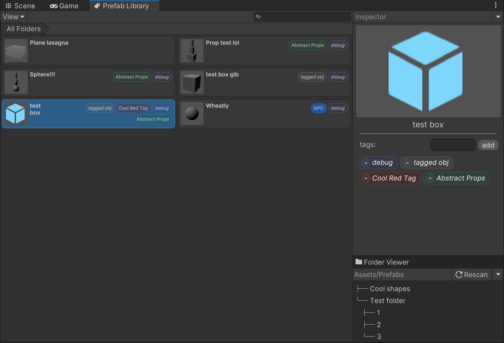

# About

This is a tool for managing and tagging your prefabs.
You can access the Library from `Toolbar > Tools > Prefab Library Explorer`.

## Tags in .Meta files
Tags are saved as *string GUIDs* within the userData of your prefab's **.meta file**. decoupling your prefabs from their meta files when moving them will result in loss of tag data, So when moving your prefabs, or syncing to you version control service of choice, make sure to also include your meta files.

## Tag Registry
After tag GUIDs are read from the meta file of your asset, the correct tag data is loaded from the **Settings** file's Tag registry, which is automatically created within `Assets/Settings`.
If unregistered tag GUIDs are found within your assets, they will be added to the Tag registry, where you can rename them and change their color.

>[!CAUTION]
>If you rename, move or delete your settings file, please close and reopen the Prefab Library window, you can then relocate it, or create a new one within the "Getting started" screen.

>[!CAUTION]
>I trust in your judgment to not manually modify the tags of a prefab within its .meta file, and to not do anything weird in general until the tool is more ironed out.

This tool was made using Unity 2021.3.1f1 with the UIElements (UI Toolkit) Package. by [Farbod Nejati](https://github.com/FarbodNejati)
